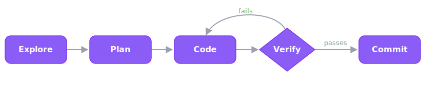

# Claude Code cheatsheet

Everything in one place. <kbd>Cmd</kbd>+<kbd>F</kbd> is your friend. Deep links go to
the full reference.

## Prompt prefixes

| Prefix | Does |
|---|---|
| `/` | Run a slash command or skill (type `/` to list) |
| `@` | Mention a file/folder or MCP resource (`@src/auth.ts`) |
| `!` | Run a shell command; output goes into context |

## Essential keys

| Key | Action |
|---|---|
| <kbd>Shift</kbd>+<kbd>Tab</kbd> | Cycle [permission mode](./reference/permission-modes.md): default → acceptEdits → plan |
| <kbd>Esc</kbd> | Interrupt the current turn |
| <kbd>Esc</kbd> <kbd>Esc</kbd> | Rewind menu (when input is empty) |
| <kbd>Ctrl</kbd>+<kbd>O</kbd> | Transcript viewer |
| <kbd>Ctrl</kbd>+<kbd>R</kbd> | Reverse history search |
| <kbd>Ctrl</kbd>+<kbd>B</kbd> | Background the current task |
| <kbd>Ctrl</kbd>+<kbd>T</kbd> | Task list |
| <kbd>Ctrl</kbd>+<kbd>G</kbd> | Edit the prompt/plan in `$EDITOR` |
| <kbd>Alt</kbd>+<kbd>P</kbd> / <kbd>Alt</kbd>+<kbd>T</kbd> | Switch model / toggle thinking |
| <kbd>Ctrl</kbd>+<kbd>C</kbd> / <kbd>Ctrl</kbd>+<kbd>D</kbd> | Cancel input / exit |

Full list → [keyboard shortcuts](./reference/keyboard-shortcuts.md).

## Permission modes

| Mode | Behavior |
|---|---|
| `default` | Reads freely; asks before edits/commands |
| `acceptEdits` | Auto-applies file edits + in-scope fs commands (`mkdir`/`mv`/`cp`/`rm`) |
| `plan` | Research & plan only — no edits |
| `auto` | Runs with a server-side safety classifier (preview, v2.1.83+) |
| `dontAsk` | Runs only pre-approved tools, asks for nothing else (CI) |
| `bypassPermissions` | No checks — only in a sandbox (`--dangerously-skip-permissions`) |

Fine-grained: `/permissions` → allow/deny patterns like `Bash(npm run test:*)`.

## Most-used slash commands

| Command | Does |
|---|---|
| `/help` | List everything |
| `/init` | Generate a `CLAUDE.md` from the codebase |
| `/clear` | New conversation, keep project memory (use between tasks) |
| `/memory` | Edit persistent memory ([CLAUDE.md](./reference/claude-md.md)) |
| `/compact [focus]` | Compress the conversation, keep the essentials |
| `/context` | Show context-window usage |
| `/model` · `/effort` | Switch model · set reasoning effort |
| `/usage` | Token use + plan limits (5h + weekly) |
| `/rewind` | Restore code/conversation to a checkpoint |
| `/resume` | Resume a past session |
| `/code-review` | Review the current diff |
| `/doctor` | Diagnose & auto-fix |

## CLI flags

| Command | Does |
|---|---|
| `claude` | Start interactive session |
| `claude "query"` | Start with a first prompt |
| `claude -p "query"` | Headless/print mode (exits) — for scripts/CI |
| `claude -c` / `--continue` | Resume the most recent session in this dir |
| `claude -r <id\|name>` | Resume a specific session |
| `claude --model sonnet` | Pick a model |
| `claude --permission-mode plan` | Start in a permission mode |
| `claude -w` / `--worktree` | Run in an isolated git worktree |
| `claude doctor` | Health check |

Full list → [CLI reference](./reference/cli.md). Note: `claude --help` isn't exhaustive.

## Models (pick by task)

| Alias | Use for |
|---|---|
| `haiku` | Trivial / formatting |
| `sonnet` | ~80% of work (default for most) |
| `opus` | Hard multi-file refactors, tricky bugs, architecture |
| `opusplan` | Plan with Opus, execute with Sonnet |

Details → [models & effort](./reference/models-and-effort.md) · [cost](./guides/cost-optimization.md).

## The core loop

> [!TIP]
> Give Claude a check it can run — tests, a build, a screenshot. That's the difference between a session you watch and one you walk away from.

## Quick wins

| Want to… | Do |
|---|---|
| Start fresh between tasks | `/clear` |
| Understand a repo | Ask it questions like you would a senior engineer → [guide](./guides/onboard-a-codebase.md) |
| Fix a bug | Paste the stack trace → "write a failing test, then fix the root cause" → [guide](./guides/fix-a-bug.md) |
| Stop being asked repeatedly | `/permissions` allowlist, or <kbd>Shift</kbd>+<kbd>Tab</kbd> → acceptEdits |
| Spend less | Sonnet by default; `/clear` often; lean `CLAUDE.md` → [cost guide](./guides/cost-optimization.md) |
| Work in parallel | `claude -w` (worktrees) → [guide](./guides/parallel-work-worktrees.md) |
| Automate it | `claude -p` headless → [guide](./guides/headless-and-ci.md) |

---

New here? Start with the [Learning path](./learning-path.md). Want the deep dives? Browse
[Reference](./reference/cli.md). Setting up a machine? [One-command setup](./environment/bootstrap-setup.md).
