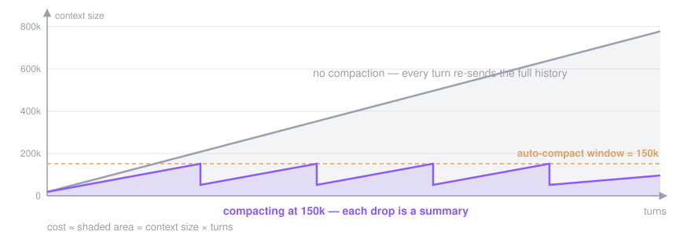

# Tune auto-compaction

When the conversation grows close to the context limit, Claude Code **compacts automatically**: it summarizes the history so far and continues from the summary, so a full window never ends the session. The **auto-compact window** is how full the context is allowed to get before that pass runs — and you can move it.

This page covers when the automatic pass fires, the four levers that set the threshold, and why you'd move it in either direction. For what compaction preserves and loses, see [The context window](../explanation/context-window.md).

> [!IMPORTANT]
> **Last verified against Claude Code 2.1.226 on 2026-08-10.** Compaction behavior moves between releases; claims marked *Observed* are measurements from that build, not documented guarantees.

## When it fires

With nothing configured, Claude Code compacts when the conversation reaches the model's context limit — except in sessions that compact earlier: cloud sessions compact as they approach the limit, Sonnet 4.6 and Opus 4.6 without extended context compact at the 200K boundary, and so do Opus 4.8 and Opus 5 when they run with a 200K context window (as on Amazon Bedrock, Google Cloud's Agent Platform, and Microsoft Foundry); Sonnet 5 compacts at its own default threshold. The window is always capped at the model's context window: setting 1M on a 200K model gets you 200K.

To turn the automatic pass off entirely, set `autoCompactEnabled` to `false` in [settings.json](../reference/settings.md), or `DISABLE_AUTO_COMPACT=1` in the environment — the manual `/compact` still works. (`DISABLE_COMPACT=1` goes further and disables `/compact` too.)

## The four levers

| Lever | Scope | Notes |
| --- | --- | --- |
| `/autocompact 500k` | This session, and saved for later ones | Writes `autoCompactWindow` to your user settings and applies it now. A higher-priority settings scope (e.g. managed settings) still wins, and the command says so. `/autocompact auto` returns to the model-tuned window |
| `claude --autocompact 500k` | One launch | Overrides your saved setting without changing it. Unlike the command, not preempted by managed settings |
| `CLAUDE_CODE_AUTO_COMPACT_WINDOW` | While set | **Beats all three others.** Plain integer only — `500k` reads as `500` and clamps to the 100K minimum |
| `autoCompactWindow` in settings.json | The file's scope | `100000`–`1000000` tokens; unset means the model-tuned window |

The command and the flag (both require v2.1.221 or later) accept `200000`, `500k`, `1M`, or a bare `100`–`1000` meaning thousands. The environment variable is the odd one out: digits only.

*Observed on 2.1.226:* run `/autocompact` with no value and it reports the active window and where it came from — `Auto-compact window: 150k tokens (from CLAUDE_CODE_AUTO_COMPACT_WINDOW)`. The same output warns that "the auto setting picks a window tuned for your model and is strongly recommended", and that overriding it "may result in high token usage, especially when resuming long sessions."

Two refinements:

- **`CLAUDE_AUTOCOMPACT_PCT_OVERRIDE`** (1–100) fires the pass at a *percentage* of the window instead — `50` compacts at half full. It can only lower the threshold, applies to subagents too, and only in sessions that compact before the model's context limit.
- **Setting the variable stops your status line from telling you when compaction will fire.** `used_percentage` always measures against the model's full window, so once `CLAUDE_CODE_AUTO_COMPACT_WINDOW` is set, the bar and the threshold no longer line up.

## Why move it down: the cost curve

Every turn re-sends the whole conversation, so the tokens a session burns grow with **context size × turns** — the shaded area under the curve:



A smaller window caps the left side of that multiplication. *Observed on a real K3 session (2.1.226):* 1,415 turns with the context climbing to ~785K tokens burned **557M cache-read tokens** — about 394K re-sent per turn. Capped at 150K, the same conversation re-sends well under half that per turn. On a quota-based plan, that difference is what a weekly limit feels.

The tradeoffs are real, and both directions are documented:

- **Too small** compacts prematurely and loses context — the summary keeps the gist, not the detail, and path-scoped rules and nested `CLAUDE.md` files are summarized away until their files are read again.
- **Too large** — above what your provider actually honours — causes context-length errors instead of clean compaction.
- **Compacting is itself a large request** (it reads the conversation it summarizes), so very frequent compaction on a huge window buys little. When you don't need continuity at all, `/clear` costs nothing.

## Why leave it on `auto`

The default window is tuned per model — including the early-compaction cases listed above — and the harness itself calls the auto setting "strongly recommended" (the `/autocompact` output quoted above). If you work in long, continuous sessions where losing detail mid-task hurts more than the tokens cost, `auto` (or a large window on a 1M model) is the right choice. Moving the window down is a deliberate cost-over-continuity trade, not a free win.

## On a third-party endpoint

Behind `ANTHROPIC_BASE_URL`, Claude Code sizes the window from the model ID and falls back to a default for one it doesn't recognise — *Observed on 2.1.226:* that default is 200K, a figure Anthropic doesn't document. So the auto-compact window must be set to the provider's real ceiling, or compaction fires far too late (context-length errors) or far too early. Kimi publishes the pairing in its Claude Code setup docs — and the value follows the context your plan actually gives the model, not the model name:

| Kimi setup | Context | `CLAUDE_CODE_AUTO_COMPACT_WINDOW` |
| --- | --- | --- |
| Kimi Code — Andante / Moderato (`kimi-for-coding`, `k3-256k`) | 256K | `262144` |
| Kimi Code — Allegretto and above (`k3` at 1M) | 1M | `1048576` |
| Kimi platform — `kimi-k3` (1M) / `kimi-k2.7-code` (256K) | per model | `1048576` / `262144` |

On Kimi Code the same `k3` model runs at 256K on the lower tiers and 1M on Allegretto and above — match the number to your tier (see the [tier table](./non-anthropic-endpoints.md#worked-example-kimi-code)). Note also that Kimi writes the 1M window as `1048576` (2²⁰), while the variable's documented range ends at `1000000` — so expect that value to clamp to `1000000`. Setting the variable deliberately **below** the provider ceiling (e.g. `150000` on a 1M model) is the cost-curve trade from the previous section: compacts sooner, every turn cheaper, summaries more often.

Kimi's docs also warn: pick **one** configuration method — shell exports *or* the `env` block of `settings.json` — and don't mix them, because the settings file wins. *Observed on 2.1.226:* with `CLAUDE_CODE_AUTO_COMPACT_WINDOW` in the `settings.json` `env` block, exporting a different value in the shell has no effect — `/autocompact` still reports the settings-file value. Changes to that file need a restart to take effect.

The full setup — tier table, `CLAUDE_CODE_MAX_CONTEXT_TOKENS`, the `[1m]` suffix, and what stops working — is in [Run against a non-Anthropic endpoint](./non-anthropic-endpoints.md).

## Check it's working

```bash
# what does the harness think the window is?
jq '.autoCompactWindow, .env.CLAUDE_CODE_AUTO_COMPACT_WINDOW' ~/.claude/settings.json
```

Then, inside a session:

```text
/autocompact     # shows the active window (observed: also its source)
/context         # live breakdown of what's filling it
```

If `/autocompact` reports a different source than you expect, remember the precedence: **environment variable → flag → command-saved setting**, with managed settings above the command.

## Related

- [The context window](../explanation/context-window.md) — what compaction preserves, and `/compact` vs `/clear`
- [Optimize cost & context](../guides/cost-optimization.md) — the other half of the cost curve
- [settings.json](../reference/settings.md) — where `autoCompactWindow` and the `env` block live
- [Run against a non-Anthropic endpoint](./non-anthropic-endpoints.md) — third-party setup end to end

**Sources:** [Explore the context window](https://code.claude.com/docs/en/context-window) · [Environment variables](https://code.claude.com/docs/en/env-vars) · [Settings](https://code.claude.com/docs/en/settings) · [Kimi for Claude Code](https://platform.kimi.ai/docs/guide/claude-code-kimi)
