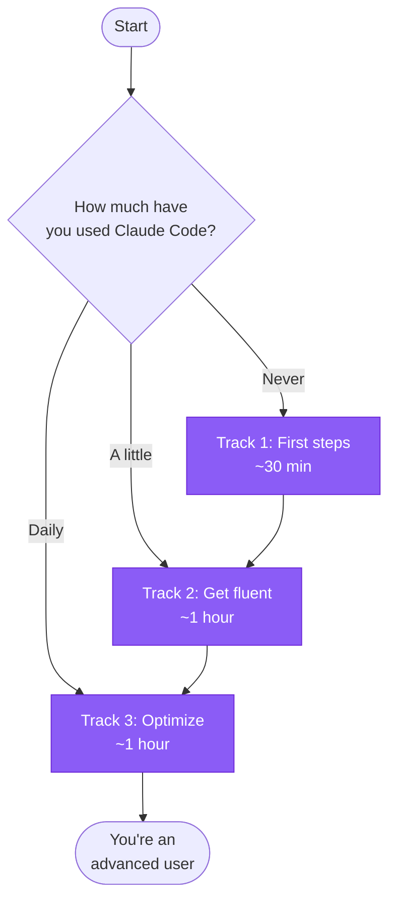

# Learning path

Not sure where to start? Answer one question and follow your track. Each step lists
a rough time so you can budget your learning.

## Where are you?

> [!TIP]
> Pick the first statement that's true for you, then jump to that track below.

- **"I've never run Claude Code."** → [Track 1: First steps](#track-1-first-steps)
- **"I've used it a bit but wing it."** → [Track 2: Get fluent](#track-2-get-fluent)
- **"I use it daily and want to go faster / cheaper."** → [Track 3: Optimize](#track-3-optimize-like-a-pro)

---

## Track 1: First steps

Goal: install Claude Code and finish your first real task. **~30 minutes.**

| # | Step | Time |
|---|------|------|
| 1 | [Install Claude Code](./getting-started/installation.md) — or the [one-command Mac setup](./environment/bootstrap-setup.md) | 10 min |
| 2 | [Quickstart (5 minutes)](./getting-started/quickstart.md) — your first win | 5 min |
| 3 | [Your first real session](./getting-started/your-first-session.md) — prefixes, permission modes, the explore→plan→code→commit loop | 15 min |

> [!NOTE]
> You're ready to do real work after Track 1. Come back for Track 2 when you want to stop "winging it."

## Track 2: Get fluent

Goal: build the right mental model and learn the task recipes. **~1 hour.**

| # | Step | Time |
|---|------|------|
| 1 | [How Claude Code works](./explanation/how-claude-works.md) — the agent loop | 10 min |
| 2 | [The context window](./explanation/context-window.md) — your most important resource | 10 min |
| 3 | [When to use what](./explanation/when-to-use-what.md) — plan mode, subagents, skills, hooks | 10 min |
| 4 | Pick two guides you'll actually use: [onboard a codebase](./guides/onboard-a-codebase.md), [fix a bug](./guides/fix-a-bug.md), [refactor safely](./guides/refactor-safely.md) | 20 min |
| 5 | [Best practices](./best-practices.md) — skim the whole thing once | 10 min |

## Track 3: Optimize like a pro

Goal: go faster, cheaper, and parallel. **~1 hour.**

| # | Step | Time |
|---|------|------|
| 1 | [Optimize cost & context](./guides/cost-optimization.md) — model choice, `/clear` vs `/compact`, lean CLAUDE.md | 15 min |
| 2 | [Subagents](./reference/subagents.md) + [Skills](./reference/skills.md) — extend Claude and protect context | 15 min |
| 3 | [Hooks](./reference/hooks.md) — deterministic automation (format, guardrails) | 10 min |
| 4 | [MCP](./reference/mcp.md) — connect external tools (keep it lean) | 10 min |
| 5 | [Parallel work with git worktrees](./guides/parallel-work-worktrees.md) + [headless & CI](./guides/headless-and-ci.md) | 10 min |
| 6 | Steal from the [asset library](https://github.com/bogdanmatasaru/claude-code-guide/tree/main/assets) — `CLAUDE.md` templates, commands, hooks | — |

---

## Keep this open

The [Cheatsheet](./cheatsheet.md) is a single-page, Cmd-F-friendly reference once you
know your way around. Bookmark it.
